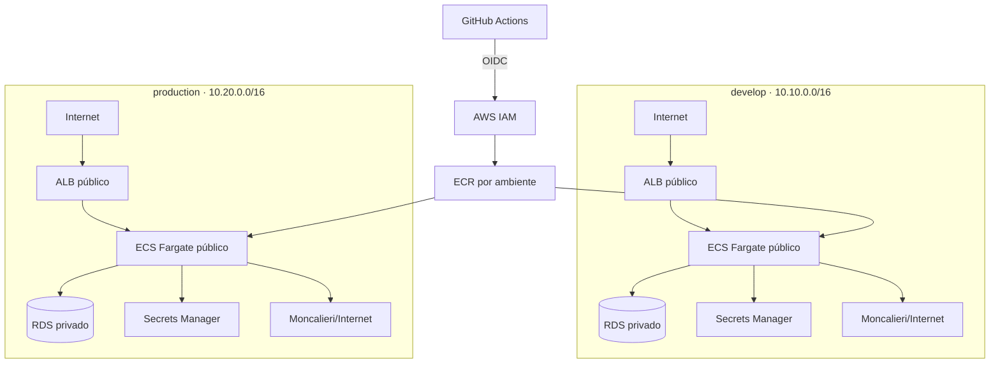

# Infraestrutura AWS — middleware-boletos

Terraform provisiona dois ambientes independentes em `us-east-1`: `develop` (HML, `10.10.0.0/16`) e `production` (`10.20.0.0/16`). Nenhum recurso é criado pela simples execução dos workflows de plan; todos os applies são manuais.



## Estrutura

- `bootstrap/terraform-state`: bucket S3 versionado, criptografado, bloqueado ao público, lockfile S3 e provider/role OIDC do GitHub.
- `modules`: `network`, `security`, `ecr`, `cloudwatch`, `rds`, `secrets`, `iam`, `dns`, `alb` e `ecs`.
- `environments/develop` e `environments/production`: roots isolados com states e parâmetros próprios. Os arquivos Terraform comuns são links para `environments/shared`, evitando drift por cópia.

Terraform `>= 1.10, < 2.0` e AWS provider `~> 6.0` são fixados. O backend usa locking S3 nativo (`use_lockfile = true`), sem DynamoDB.

## Rede e segurança

Cada ambiente usa as duas primeiras AZs disponíveis, ordenadas pelo provider, duas subnets públicas (`/24`, índices 0 e 1) e duas subnets privadas de banco (`/24`, índices 10 e 11). Apenas as públicas têm rota `0.0.0.0/0` para o Internet Gateway. Não existe NAT Gateway.

As tasks Fargate ficam nas subnets públicas com `assign_public_ip = true`, necessário para ECR e Moncalieri. O IP público não expõe a aplicação: o SG da API aceita TCP/8080 somente do SG do ALB. O ALB aceita 80/443 da Internet. O SG do RDS aceita 5432 somente do SG da API, e o RDS usa `publicly_accessible = false`.

Evolução futura: mover ECS para subnets privadas com NAT Gateway ou VPC endpoints quando custo, tráfego e criticidade justificarem. Também ficam fora desta etapa: Multi-AZ, WAF, SQS/workers, ElastiCache e observabilidade avançada.

## Bootstrap e primeiro provisionamento

O bootstrap é executado pelo workflow manual `AWS Bootstrap`, usando o GitHub Environment `bootstrap` e a role criada uma única vez na conta AWS. O workflow garante que o bucket exista, inicializa o backend remoto em `middleware-boletos/bootstrap/terraform.tfstate`, importa o bucket pré-criado e aplica suas configurações e a role operacional definitiva.

A role de bootstrap precisa acessar os objetos do próprio state. Além das permissões de bucket e IAM configuradas inicialmente, sua policy deve conter, substituindo o nome do bucket:

```json
{
  "Effect": "Allow",
  "Action": ["s3:GetObject", "s3:PutObject", "s3:DeleteObject"],
  "Resource": "arn:aws:s3:::NOME_EXATO_DO_BUCKET/middleware-boletos/bootstrap/*"
}
```

Inclua também `iam:ListAttachedRolePolicies` na declaração `ManageProjectGitHubRole`; o provider AWS usa essa leitura ao reconciliar a role operacional.

No Environment `bootstrap`, configure `AWS_BOOTSTRAP_ROLE_ARN` e `AWS_ACCOUNT_ID`. Execute `AWS Bootstrap` com o nome do bucket, o ARN do provider OIDC existente e a confirmação `BOOTSTRAP`. Ao concluir, o resumo do job mostra os valores de `TERRAFORM_STATE_BUCKET` e `AWS_ROLE_ARN`.

Configure esses dois valores nos Environments `develop` e `production`, junto de `CORS_ALLOWED_ORIGINS`. Configure como Repository variables `AWS_ROLE_ARN`, `TERRAFORM_STATE_BUCKET`, `DEVELOP_CORS_ALLOWED_ORIGINS` e `PRODUCTION_CORS_ALLOWED_ORIGINS`, usados pelos plans de PR.

O primeiro provisionamento de cada ambiente é feito pelo workflow `Terraform Bootstrap Environment`. Ele cria primeiro o ECR, publica a tag imutável `bootstrap` se ainda não existir, executa plan/apply completo, aguarda o ECS e testa `/health` e `/ready`. Develop deve ser inicializado primeiro; production requer aprovação do Environment correspondente. Depois, deploys usam sempre o SHA completo do commit.

O módulo ECS depende explicitamente das versões do Secrets Manager e das policies IAM: nenhuma task é iniciada antes de existir uma versão `AWSCURRENT` e de a execution role poder lê-la. Ao final do primeiro apply, o workflow força uma nova implantação para recuperar com segurança qualquer tentativa inicial interrompida.

## Parâmetros e custos

Develop começa com 1 task (256 CPU/512 MiB, min 1/max 2), RDS `db.t4g.micro`, 20 GiB gp3 com autoscaling até 100 GiB, Single-AZ, 3 dias de backup, sem deletion protection, logs por 7 dias. Production começa com 1 task (min 1/max 4), o mesmo tamanho de compute/database, 7 dias de backup, deletion protection, snapshot final e logs por 30 dias. Autoscaling usa CPU 60% e memória 70%, cooldown de saída 60s e entrada 300s. Rolling deploy usa 100/200% e circuit breaker com rollback.

O RDS permanece na major PostgreSQL 16, mas a minor não é hardcoded: o data source `aws_rds_engine_version` seleciona a minor mais recente disponível em `us-east-1`. Isso evita falhas quando a AWS retira uma versão patch antiga do catálogo regional.

O padrão é `X86_64`, compatível com o build atual `linux/amd64`. Para ARM64, primeiro publique imagens `linux/arm64` e altere `cpu_architecture = "ARM64"`. Custos são controlados por `ecs_cpu`, `ecs_memory`, capacidades, classe/storage/Multi-AZ do RDS, retenção de logs e flags de domínio/alarmes.

O Terraform gera as senhas do banco, JWT e bootstrap administrativo, e grava um JSON no Secrets Manager com `DATABASE_URL`, `JWT_SECRET`, `JWT_ISSUER`, `JWT_AUDIENCE`, `CORS_ALLOWED_ORIGINS`, `BOOTSTRAP_ADMIN_EMAIL`, `BOOTSTRAP_ADMIN_NAME` e `BOOTSTRAP_ADMIN_PASSWORD`. Elas não são outputs nem aparecem nos logs dos workflows. A senha administrativa tem 32 caracteres aleatórios e também fica protegida pelo state remoto criptografado. Credenciais Moncalieri continuam no modelo existente `TenantProvider.Config`; não são duplicadas em segredo global.

## GitHub Actions

Crie GitHub Environments `develop` e `production`. Em cada um configure as variáveis abaixo; para o workflow de PR, configure os mesmos nomes também como Repository variables (plans não entram no Environment e, portanto, não disparam aprovação de production):

- `AWS_ROLE_ARN`
- `TERRAFORM_STATE_BUCKET`
- `CORS_ALLOWED_ORIGINS`

Configure required reviewers no environment `production`. A proteção é uma configuração do GitHub, não um arquivo versionado.

- `terraform-plan.yml`: PRs de infra, fmt/init/validate/plan nos dois states, nunca apply.
- `aws-bootstrap.yml`: bootstrap controlado do state e da role operacional.
- `terraform-bootstrap-environment.yml`: primeiro ECR/imagem/apply de cada ambiente.
- `terraform-apply-develop.yml`: apply manual de develop.
- `terraform-apply-production.yml`: apply manual de production, sujeito à aprovação.
- `deploy-backend-develop.yml`: push em `develop` com mudança backend ou manual.
- `deploy-backend-production.yml`: exclusivamente manual.
- `rollback-backend.yml`: rollback manual para uma revisão anterior da mesma família, com aprovação e smoke test.

O deploy constrói `linux/amd64`, publica `<ECR>:<commit SHA>`, registra uma task definition candidata, executa a candidata com override `migrate`, espera a task e verifica exit code. Somente após sucesso atualiza o service, espera estabilidade e testa `/health` e `/ready`. Migration falha aborta antes do update. Depois do update, o circuit breaker do ECS reverte uma implantação que não estabiliza.

### Ownership do ECS Service

A separação de responsabilidades é deliberada e segue o fluxo de execução pelo GitHub Actions:

- Terraform gerencia cluster, service, rede, load balancer, IAM, configuração-base da task e proteções de deployment.
- GitHub Actions registra e implanta revisões imutáveis da Task Definition, sempre identificadas pelo SHA do commit.
- Application Auto Scaling controla o `desired_count` dentro dos limites declarados pelo Terraform.

Por isso, o lifecycle do ECS Service ignora exclusivamente `task_definition` e `desired_count`. Essas duas propriedades possuem controladores externos definidos; não é uma regra genérica para esconder drift. Um apply de infraestrutura não reverte a aplicação para a imagem `bootstrap` nem reduz uma escala ativa. Mudanças no template da Task Definition feitas pelo Terraform tornam-se a nova base para os deploys seguintes, pois o workflow lê o output da definição-base gerenciada pelo Terraform, substitui sua imagem pelo SHA e registra a revisão candidata.

Depois do bootstrap inicial necessário para estabelecer S3 e OIDC, plans, applies, migrations e deploys dos ambientes devem ser executados pelos workflows versionados. Não registrar Task Definitions nem atualizar o ECS Service manualmente pelo console ou CLI.

## Develop / HML on-demand

Develop é ligado sob demanda: todo deploy inicia o RDS, aguarda o estado `available`, restaura o mínimo do autoscaling e o desired count do ECS para 1 antes das migrations. Não existe start matinal. O workflow **Develop Environment Control** também oferece `start`, `stop` e `status`; no start manual, aguarda estabilidade e valida `/health` e `/ready`.

Por padrão, o EventBridge Scheduler executa diariamente às 20:00 em `America/Sao_Paulo`, com `FlexibleTimeWindow = OFF`. O horário e timezone vêm exclusivamente de `shutdown_time` e `shutdown_timezone` no tfvars de develop. No shutdown, a Lambda valida `environment=develop`, define o mínimo do autoscaling como 0, reduz o ECS para 0, aguarda as tasks encerrarem e só então para o RDS. Sábados e domingos permanecem desligados se não houver deploy ou start manual.

O Terraform ignora somente o `min_capacity`, que tem ownership operacional compartilhado com essa automação; continua gerenciando `max_capacity` e os demais atributos. O módulo possui validações Terraform, payload fixo, configuração fixa da Lambda e IAM escopado que impedem sua criação/operação para production. Production permanece 24x7 com `enable_scheduled_shutdown = false`.

O RDS pode ser iniciado automaticamente pela AWS após até 7 dias parado; o shutdown diário volta a pará-lo no próximo ciclo. ECS e RDS desligados reduzem significativamente o compute mensal de develop, mas ALB, storage, ECR, Secrets, CloudWatch, VPC e outros componentes continuam provisionados e podem gerar custo fixo.

### Primeiro PLATFORM_ADMIN

O bootstrap administrativo é temporário e idempotente. Com `enable_admin_bootstrap = true`, a Task Definition recebe `ENABLE_ADMIN_BOOTSTRAP=true` e as três credenciais diretamente do Secrets Manager. Se já existir um `PLATFORM_ADMIN`, a API não cria outro usuário.

Para criar o primeiro administrador em develop:

1. Mantenha `enable_admin_bootstrap = true` em `infra/environments/develop/terraform.tfvars.example`, faça commit e push.
2. Execute `Terraform Apply Develop` no GitHub Actions. Isso atualiza o secret e a Task Definition base, mas não troca diretamente a revisão em execução.
3. Execute `Deploy Backend Develop`. O workflow deriva a revisão candidata da nova definição base, executa migrations e atualiza o ECS Service.
4. No console AWS, abra Secrets Manager, selecione `middleware-boletos-develop/api` e use **Retrieve secret value**. O login está em `BOOTSTRAP_ADMIN_EMAIL` e `BOOTSTRAP_ADMIN_PASSWORD`.
5. Confirme o login pela rota `POST /api/v1/auth/login` ou pelo frontend local apontando para a URL do ALB.
6. Altere imediatamente `enable_admin_bootstrap = false`, faça commit e push e execute novamente `Terraform Apply Develop` e `Deploy Backend Develop`.

Ao desabilitar a flag, as credenciais deixam de ser injetadas nas tasks seguintes. O usuário criado permanece no banco. Os valores continuam no secret e no state para manter o histórico Terraform, mas ficam inacessíveis à aplicação; a senha do usuário pode ser trocada pelo fluxo administrativo quando disponível. Em production, a flag permanece `false` até que um bootstrap explicitamente aprovado seja necessário.

## Domínio e frontend

Para HTTPS, defina `enable_custom_domain = true`, `domain_name`, `api_subdomain` e `route53_zone_id` de uma hosted zone existente. Terraform cria ACM, validação DNS, listener 443, redirect 80→443 e Alias para o ALB. Sem domínio, `api_url` usa HTTP no DNS do ALB.

`enable_amplify` está reservado e permanece `false`: o frontend não bloqueia a infraestrutura crítica. Para adotar Amplify depois, conecte o repositório pelo console/GitHub App ou por token guardado fora do código e crie pipeline separado.

## Destruição e recuperação

Production protege o RDS e exige snapshot final. O bucket de state tem `prevent_destroy`; para removê-lo é necessário alterar deliberadamente o bootstrap, esvaziar versões e revisar o impacto. Nunca use destroy de production como rotina. Rollback da aplicação deve preferir uma task definition anterior; migrations devem ser retrocompatíveis.
