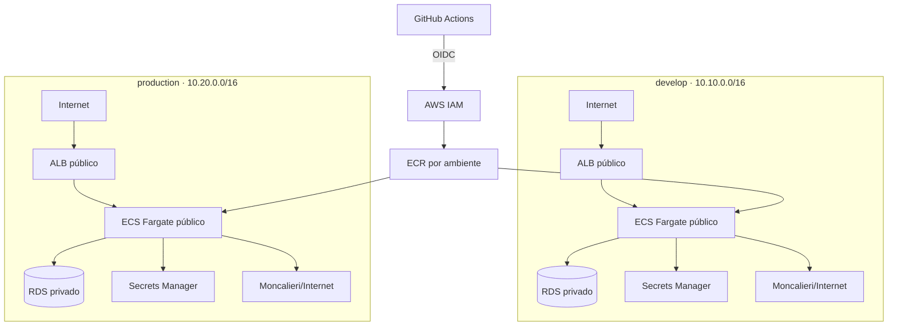

# Infraestrutura AWS — middleware-boletos

Terraform provisiona dois ambientes independentes em `us-east-1`: `develop` (HML, `10.10.0.0/16`) e `production` (`10.20.0.0/16`). Nenhum recurso é criado pela simples execução dos workflows de plan; todos os applies são manuais.



## Estrutura

- `bootstrap/terraform-state`: bucket S3 versionado, criptografado, bloqueado ao público, lockfile S3 e provider/role OIDC do GitHub.
- `modules`: `network`, `security`, `ecr`, `cloudwatch`, `rds`, `secrets`, `iam`, `dns`, `alb` e `ecs`.
- `environments/develop` e `environments/production`: roots isolados com states e parâmetros próprios. Os arquivos Terraform comuns são links para `environments/shared`, evitando drift por cópia.

Terraform `>= 1.10, < 2.0` e AWS provider `~> 6.0` são fixados. O backend usa locking S3 nativo (`use_lockfile = true`), sem DynamoDB.

## Rede e segurança

Cada ambiente usa as duas primeiras AZs disponíveis, ordenadas pelo provider, duas subnets públicas (`/24`, índices 0 e 1) e duas subnets privadas de banco (`/24`, índices 10 e 11). Apenas as públicas têm rota `0.0.0.0/0` para o Internet Gateway. Não existe NAT Gateway.

As tasks Fargate ficam nas subnets públicas com `assign_public_ip = true`, necessário para ECR e Moncalieri. O IP público não expõe a aplicação: o SG da API aceita TCP/8080 somente do SG do ALB. O ALB aceita 80/443 da Internet. O SG do RDS aceita 5432 somente do SG da API, e o RDS usa `publicly_accessible = false`.

Evolução futura: mover ECS para subnets privadas com NAT Gateway ou VPC endpoints quando custo, tráfego e criticidade justificarem. Também ficam fora desta etapa: Multi-AZ, WAF, SQS/workers, ElastiCache e observabilidade avançada.

## Bootstrap e primeiro provisionamento

O bootstrap é intencionalmente separado e mantém state local inicialmente:

```bash
cd infra/bootstrap/terraform-state
cp terraform.tfvars.example terraform.tfvars
terraform init
terraform plan
terraform apply # somente após revisão explícita
```

Se o OIDC provider já existir na conta, informe `github_oidc_provider_arn`. Copie os outputs para as GitHub Environment variables `AWS_ROLE_ARN` e `TERRAFORM_STATE_BUCKET`, em ambos os environments.

Para cada ambiente, copie `backend.hcl.example` para `backend.hcl`, ajuste o bucket, e use:

```bash
cd infra/environments/develop
cp terraform.tfvars.example terraform.tfvars
terraform init -backend-config=backend.hcl
terraform plan
```

O primeiro apply tem uma sequência especial porque o ECS exige uma imagem existente: execute primeiro `terraform apply -target=module.ecr`, autentique no ECR, publique a imagem backend com tag imutável `bootstrap`, e só então execute plan/apply completo. Depois, deploys usam sempre o SHA completo do commit.

## Parâmetros e custos

Develop começa com 1 task (256 CPU/512 MiB, min 1/max 2), RDS `db.t4g.micro`, 20 GiB gp3 com autoscaling até 100 GiB, Single-AZ, 3 dias de backup, sem deletion protection, logs por 7 dias. Production começa com 1 task (min 1/max 4), o mesmo tamanho de compute/database, 7 dias de backup, deletion protection, snapshot final e logs por 30 dias. Autoscaling usa CPU 60% e memória 70%, cooldown de saída 60s e entrada 300s. Rolling deploy usa 100/200% e circuit breaker com rollback.

O padrão é `X86_64`, compatível com o build atual `linux/amd64`. Para ARM64, primeiro publique imagens `linux/arm64` e altere `cpu_architecture = "ARM64"`. Custos são controlados por `ecs_cpu`, `ecs_memory`, capacidades, classe/storage/Multi-AZ do RDS, retenção de logs e flags de domínio/alarmes.

O Terraform gera as senhas do banco e JWT, e grava um JSON no Secrets Manager com `DATABASE_URL`, `JWT_SECRET`, `JWT_ISSUER`, `JWT_AUDIENCE` e `CORS_ALLOWED_ORIGINS`. Elas não são outputs. Credenciais Moncalieri continuam no modelo existente `TenantProvider.Config`; não são duplicadas em segredo global.

## GitHub Actions

Crie GitHub Environments `develop` e `production`. Em cada um configure as variáveis abaixo; para o workflow de PR, configure os mesmos nomes também como Repository variables (plans não entram no Environment e, portanto, não disparam aprovação de production):

- `AWS_ROLE_ARN`
- `TERRAFORM_STATE_BUCKET`
- `CORS_ALLOWED_ORIGINS`

Configure required reviewers no environment `production`. A proteção é uma configuração do GitHub, não um arquivo versionado.

- `terraform-plan.yml`: PRs de infra, fmt/init/validate/plan nos dois states, nunca apply.
- `terraform-apply-develop.yml`: apply manual de develop.
- `terraform-apply-production.yml`: apply manual de production, sujeito à aprovação.
- `deploy-backend-develop.yml`: push em `develop` com mudança backend ou manual.
- `deploy-backend-production.yml`: exclusivamente manual.

O deploy constrói `linux/amd64`, publica `<ECR>:<commit SHA>`, registra uma task definition candidata, executa a candidata com override `migrate`, espera a task e verifica exit code. Somente após sucesso atualiza o service, espera estabilidade e testa `/health` e `/ready`. Migration falha aborta antes do update. Depois do update, o circuit breaker do ECS reverte uma implantação que não estabiliza.

## Domínio e frontend

Para HTTPS, defina `enable_custom_domain = true`, `domain_name`, `api_subdomain` e `route53_zone_id` de uma hosted zone existente. Terraform cria ACM, validação DNS, listener 443, redirect 80→443 e Alias para o ALB. Sem domínio, `api_url` usa HTTP no DNS do ALB.

`enable_amplify` está reservado e permanece `false`: o frontend não bloqueia a infraestrutura crítica. Para adotar Amplify depois, conecte o repositório pelo console/GitHub App ou por token guardado fora do código e crie pipeline separado.

## Destruição e recuperação

Production protege o RDS e exige snapshot final. O bucket de state tem `prevent_destroy`; para removê-lo é necessário alterar deliberadamente o bootstrap, esvaziar versões e revisar o impacto. Nunca use destroy de production como rotina. Rollback da aplicação deve preferir uma task definition anterior; migrations devem ser retrocompatíveis.
